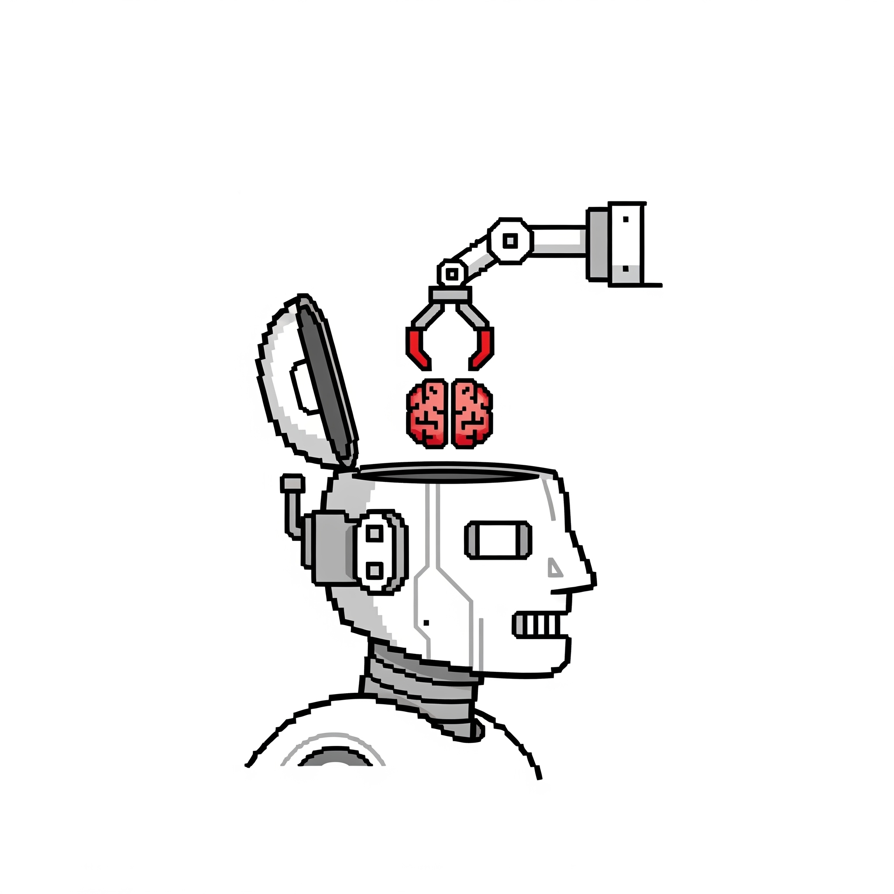
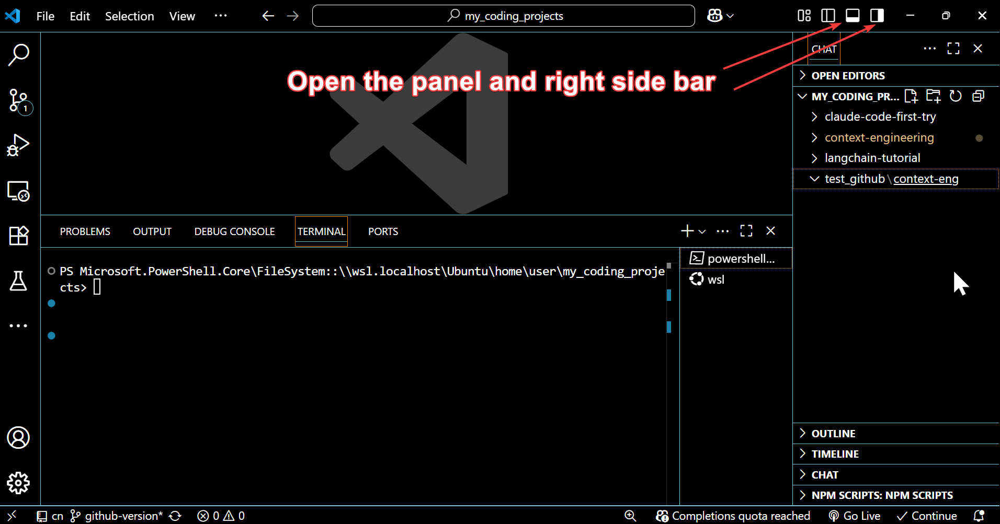
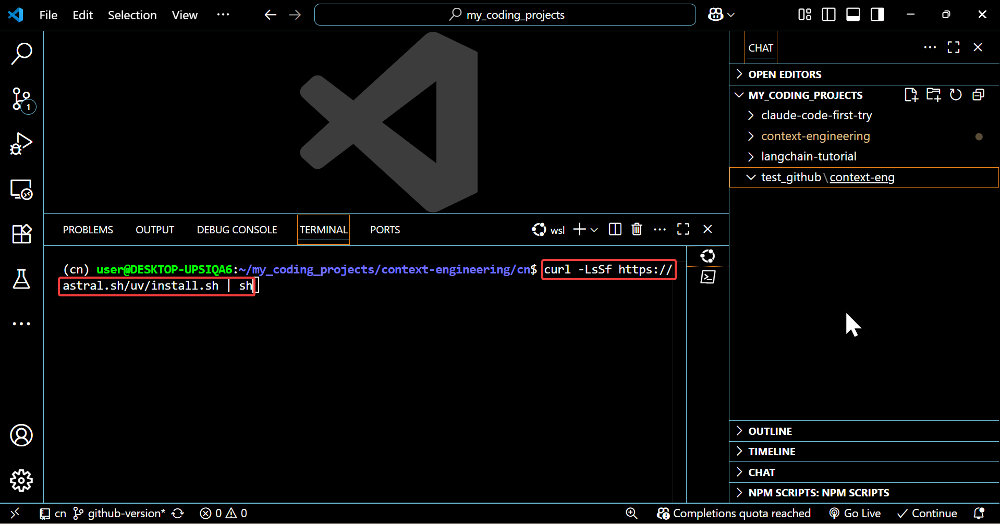
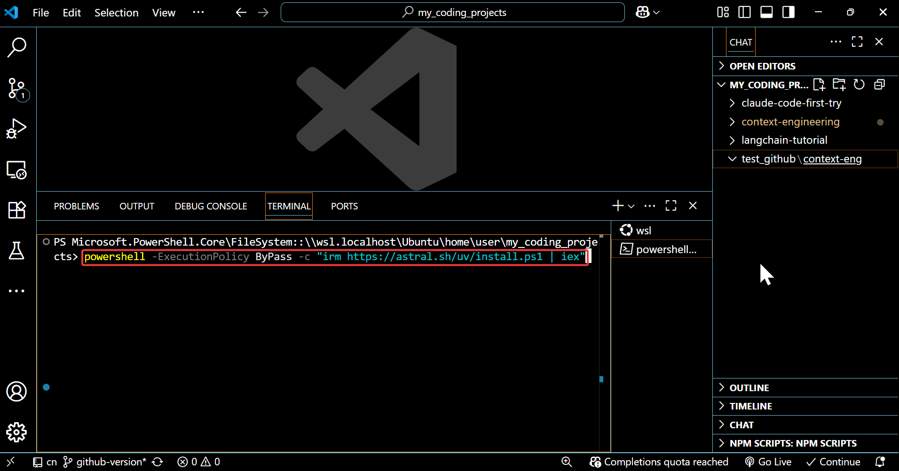
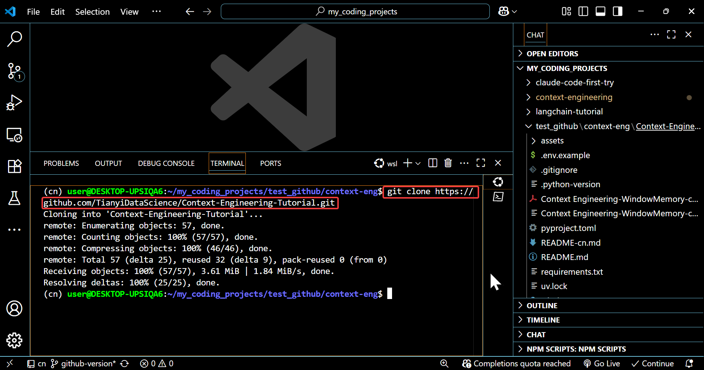
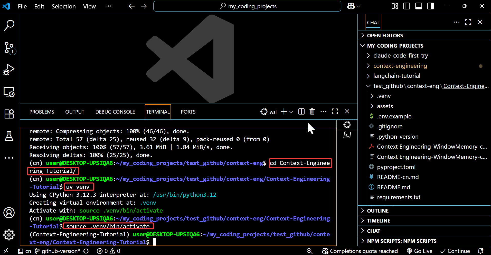
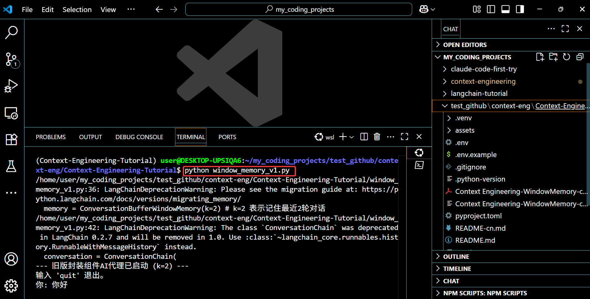

<h1 align="center">
  <br>
  </a>
  <br>
  上下文工程教程 (Context-Engineering-Tutorial)
  <br>
</h1>

<h4 align="center">一个基于 <a href="https://github.com/langchain-ai/langchain" target="_blank">LangChain 和 LangGraph</a> 的上下文工程理论与实践教程。</h4>

<p align="center">
  <a href="./README.md">English</a>・简体中文
</p>

<p align="center">
  <a href="#主要特性">主要特性</a> •
  <a href="#内容">内容</a> •
  <a href="#如何使用">如何使用</a> •
  <a href="#给非程序员的指南">给非程序员的指南</a> •
  <a href="#许可证">许可证</a>
</p>

## 主要特性

* 理论讲解幻灯片 + Python 代码实现。
* 基于Youtube和B站视频教程：木子不写代码
  * Youtube: https://www.youtube.com/channel/UCY3SgqRpZd0GWWk8dRCybdw
  * B站： https://space.bilibili.com/13416784
  * 小红书：木子不写代码
* 视频教程尚在更新中...

## 内容

* 记忆：
  * 窗口记忆：
    * 课件：Context Engineering-WindowMemory-cn.pdf
    * 实现方式1脚本(旧版langchain)：window_memory_v1.py
    * 实现方式2脚本(当前版本langchain)：window_memory_v2.py

## 如何使用
```bash
# 克隆此仓库
$ git clone https://github.com/TianyiDataScience/Context-Engineering-Tutorial.git

# 进入仓库目录
$ cd Context-Engineering-Tutorial
```

## 给非程序员的指南
1. **下载和设置VS code：**
    1. https://code.visualstudio.com/
    2. 安装并打开 vscode
    3. 在本地新建一个文件夹并在VScode中打开
       
       
2. **安装uv：**
    1. Linux/MacOS：
        
        ```bash
        curl -LsSf https://astral.sh/uv/install.sh | sh
        ```
        
        后重启终端
       
       
        
    3. Windows:
        
        ```powershell
        powershell -ExecutionPolicy ByPass -c "irm https://astral.sh/uv/install.ps1 | iex"
        ```
        
        后重启powershell
       
        
    
    ?什么是uv?
    
    uv是用于 Python 的一个非常快速的包安装器和解析器
    
    uv 主要能做到两件核心事情，并将它们做得极快：
    1. 包管理：作为 pip 和 pip-tools 的一个完整且极速的替代品。
    2. 虚拟环境管理：作为 venv 或 virtualenv 的一个快速替代品。
    ```
   
3.**克隆项目**
  1. 安装git:进入页面 https://git-scm.com/book/zh/v2/ 后点击1.5安装
  2. 终端：git clone https://github.com/TianyiDataScience/Context-Engineering-Tutorial.git
     

    
4. **进入项目目录**
    
    ```
    cd Context-Engineering-Tutorial
    ```
    
5. **创建并激活虚拟环境**：`uv` 会自动在名为 `.venv` 的文件夹中创建环境。
    1. Linux/MacOS：
        
        ```bash
        # 创建虚拟环境
        uv venv
        # 激活虚拟环境
        source .venv/bin/activate 
        ```
         

    2. Windows
        
        ```powershell
        # 创建虚拟环境 
        uv venv
        # 激活虚拟环境
        .\.venv\Scripts\Activate.ps
        ```
        
    
5. **安装所有项目的所有依赖**：
    
    ```
    uv sync
    ```
    为什么用 uv sync？ 读取 uv.lock 文件，确保安装的每一个库都和项目作者使用的版本完全一致。
    
6. **配置环境变量**：
   
   复制 .env.example 到新的.env文件
    ```bash
    # linux/mac
    cp .env.example .env
    # windows
    copy .env.example .env
    ```
    后打开这个新的 .env 文件，填入自己的 API 密钥。
    
7. **运行脚本**：
    
    ```
    # 比如运行窗口记忆对话机器人
    python window_memory_v1.py
    

    ```

## 许可证

MIT


